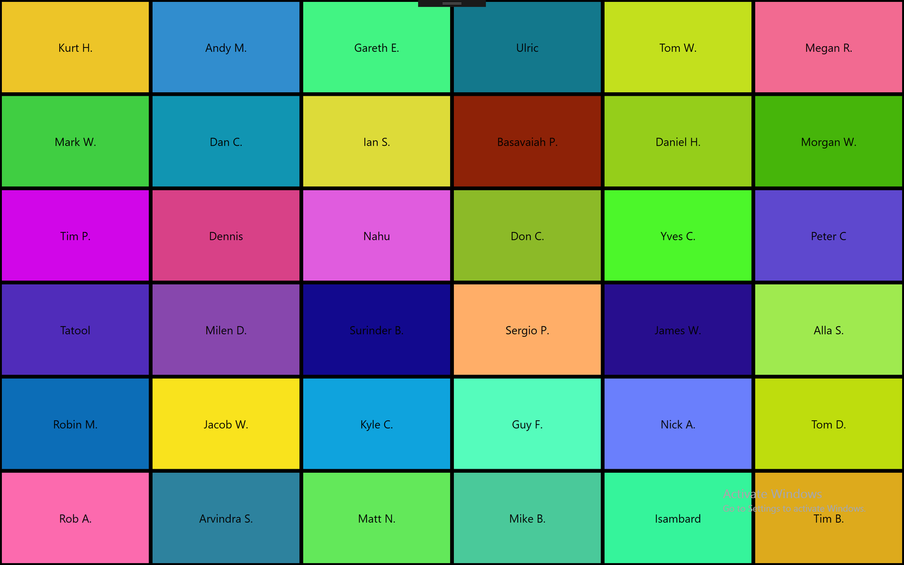

# Prize Draw

This is a tool written for the .NET Oxford meetup for when we do prize draws. Whilst primarily written for .NET Oxford, it can be used by any meetup.

It integrates with both Meetup.com and Zoom

## Meetup.com Setup

The first time you run the application, you'll see a blank screen. Press `F5`, and a dialogbox will appear asking you to enter a meetup event id. Get this by opening your event on Meetup.com, and copying the `event id` from the URL. So for example, one of the .NET Oxford events was this one ...

https://www.meetup.com/dotnetoxford/events/235884873/

... so the event id for this event is `235884873`.

This will then retrieve all the attendees from your Meetup.com event. That is, guests who have RSVPd with 'yes'. This may take a minute, as it also downloads all their profile pictures.

Once this is complete, you'll need to restart the application.

## Usage

After grabbing all the attendee data, and restarting, you should see a fullscreen window looking something like this ...

Press the `space` key to start the draw. The selected tile (as shown below), will shuffle randomly where the selected tile will show the attendee's profile picture.

Pressing the `space` key again will then slow down the shuffle, and after a few seconds, stop on the winning tile. The winning tile will then grow/animate to a much larger tile at the centre of the screen showing both the winner's name and profile picture ...

The winner details will be stored in a text file in the following folder:

> "%appdata%\Roaming\PrizeDraw"

This folder is actually also where the list of attendees and their profile images are stored.

Because sometimes you may draw winners that are no-shows, requiring a redraw - you can also press the `enter` key when on you have a genuine winner - and a second entry will be added to the winner text file for that winner with the text *"Flagged as genuine winner"*. This helps you reconcile the winners later on, and differentiate between no-show winners and actual winners. I added this after having this problem a few times where a had a list of winners, and had forgotten which were re-draws vs genuine winners.

## Zoom Setup

If you're hosting your event remotely via Zoom, then you can set this up to pull attendees directly from the Zoom meeting. This has the added benefit of avoiding the no-show problem mentioned above! Sadly, to use the Zoom API to get current participants requires the Zoom Business tier and above. Even the Pro tier doesn't allow this. To get around this issue, we use Zoom webhooks instead (which is supported in all tiers), and then take advantage of Azure Functions and Azure Table Storage. Unfortunately, if you want to use the prize draw app with Zoom, you'll need to set these up yourself. I'm afraid this does require a bit of Azure knowledge though. I wrote a blog post about the Zoom integration, which can be found [here](https://www.danclarke.com/2020-prizedraw-zoom). These are the steps to set this up...

* [Create an Azure Function](https://docs.microsoft.com/en-us/azure/azure-functions/functions-create-first-azure-function) and copy the Azure Function code from the [blog post](https://www.danclarke.com/2020-prizedraw-zoom). When you create the Azure Function, also create an Azure Storage account (there should be an option when creating the Function app to do this).
* In your Zoom account, [create a webhook-only app](https://marketplace.zoom.us/docs/guides/build/webhook-only-app), then register two events - _"Participant/Host joined meeting"_, and _"Participant/Host left meeting"_. Then set the event notification URL to point to your Azure Function.

One done, when you host a Zoom meeting, the Azure Table Storage will be populated with the event details of when attendees join or leave your meeting. Note that this will do so for _all_ your meetings, storing the meeting id as the partition key.

The only thing left now is to point the prize-draw app at your Azure Table Storage, so it can read from it. All you have to do here is set an environment variable called `PrizeDraw_AzureStorageConnectionString` and set the value to your Azure Table Storage connection string.

Then when launching the prize draw app, set the Zoom meeting ID as a command line argument...

    PrizeDraw.exe -zoommeetingid <meeting id number>

Note that Zoom doesn't provide a way to get at Zoom profile pictures. So sadly, unlike the Meetup.com integration, the tiles will just contain the usernames.

I'm aware this is overly complicated to set up. If Zoom allowed us to pull current attendees via their REST API for tiers less than their Business subscription - this would be _much_ simpler! Feel free to reach out to [me on Twitter](https://twitter.com/dracan) if you need a hand with this. My DMs are open, and I'm happy to jump on a Zoom call to help you set this up.

## Sounds Effects

There are two sound effects ...

1. A knocking sound each time the selected tile changes.
1. A fanfare sound when the selected tile lands on the winner.

These are disabled by default. You can easily enable them by renaming the wav files in the `Media` folder. Or you can switch them out with other wav files. See the `readme.md` file in the `Media` folder.
