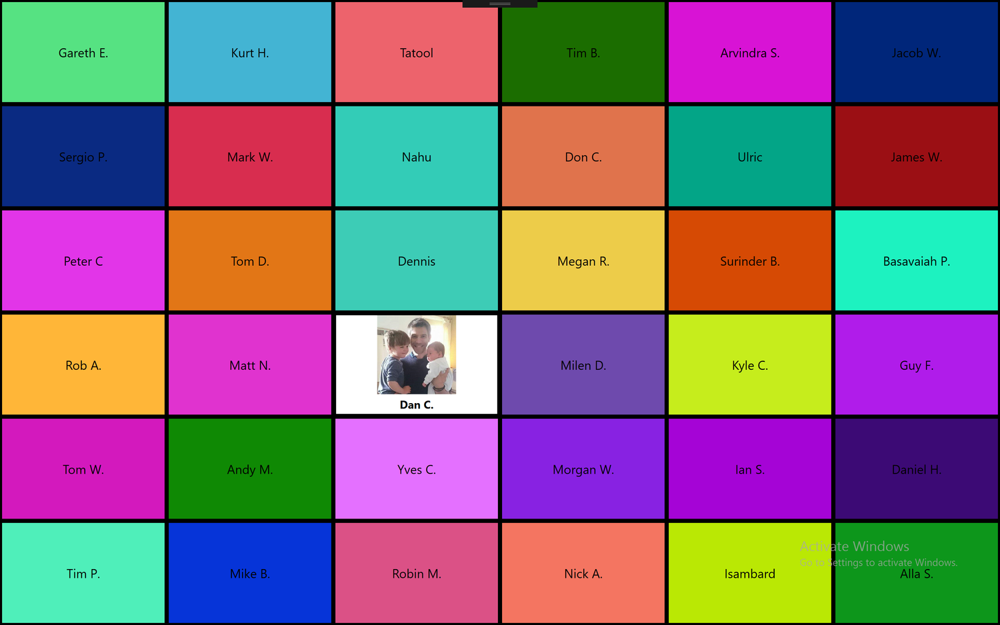
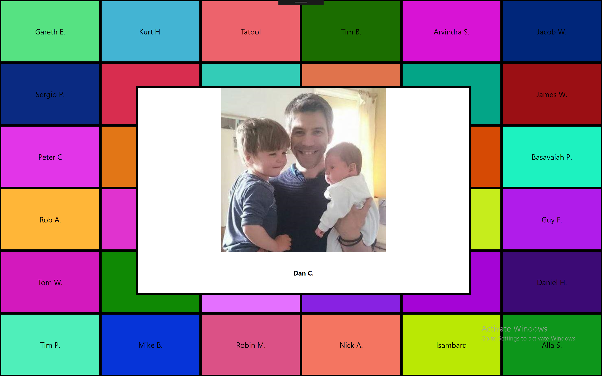

# Prize Draw

This is a tool written for the .NET Oxford meetup for when we do prize draws. Whilst primarily written for .NET Oxford, it can be used by any meetup.

## Setup

Before first running the application, you'll have to point it at your event on Meetup.com. At the moment, this is just an app.config setting called `MeetupDotComEventId`. Start by opening your event on Meetup.com, and copying the `event id` from the URL. So for example, one of the .NET Oxford events was this one ...

https://www.meetup.com/dotnetoxford/events/235884873/

... so the event id for this event is `235884873`.

You can enter this into the app by editing the `app.config` file (it's fairly obvious what to change when you view this file).

## Retrieving the list of attendees

The first time you run the application, you'll see a blank screen. Press `F5`, and a dialogbox will appear with a single button. Press it, and it'll retrieve all the attendees from your Meetup.com event. That is, guests who have RSVPd with 'yes'. This may take a minute, as it also downloads all their profile pictures.

At the time of writing, once this is complete, you'll need to restart the application.

## Usage

After grabbing all the attendee data, and restarting, you should see a fullscreen window looking something like this ...

Press the `space` key to start the draw. The selected tile (as shown below), will shuffle randomly where the selected tile will show the attendee's profile picture.

Pressing the `space` key again will then slow down the shuffle, and after a few seconds, stop on the winning tile. The winning tile will then grow/animate to a much larger tile at the centre of the screen showing both the winner's name and profile picture ...

The winner details will be stored in a text file in the following folder:

> "%appdata%\Roaming\PrizeDraw"

This folder is actually also where the list of attendees and their profile images are stored.

Because sometimes you may draw winners that are no-shows, requiring a redraw - you can also press the `enter` key when on you have a genuine winner - and a second entry will be added to the winner text file for that winner with the text *"Flagged as genuine winner"*. This helps you reconcile the winners later on, and differentiate between no-show winners and actual winners. I added this after having this problem a few times where a had a list of winners, and had forgotten which were re-draws vs genuine winners.

## Sounds Effects

There are two sound effects ...

1. A knocking sound each time the selected tile changes.
1. A fanfare sound when the selected tile lands on the winner.

These are disabled by default. You can easily enable them by renaming the wav files in the `Media` folder. Or you can switch them out with other wav files. See the `readme.md` file in the `Media` folder.
